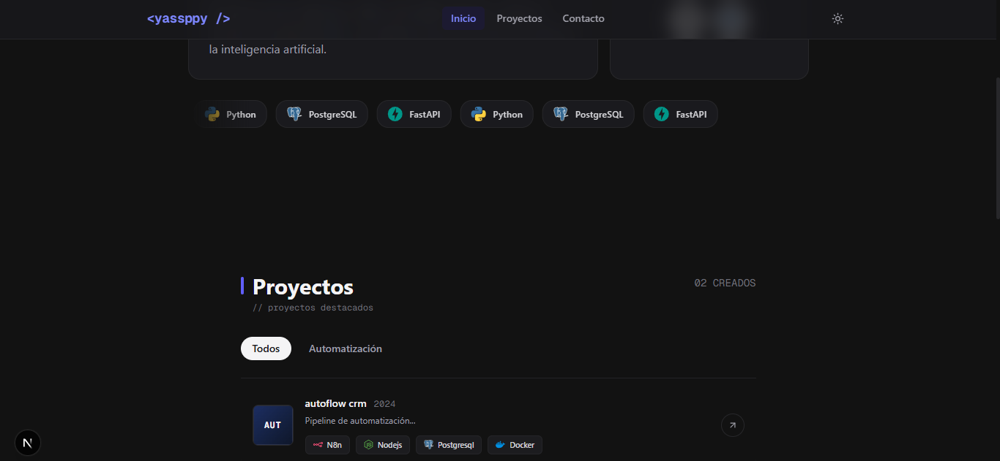

# 🍱 Portafolio Web - Bento Grid Style

Plantilla de portafolio web personal inspirada en el diseño **Bento Grid**, limpia, minimalista y totalmente adaptable a modo claro y oscuro.



---

## 🛠️ Tecnologías

- **Framework:** [Next.js](https://nextjs.org/) (App Router)
- **Runtime & Package Manager:** [Bun](https://bun.sh/)
- **Estilos:** [Tailwind CSS](https://tailwindcss.com/)
- **Animaciones:** [Framer Motion](https://framer.com/motion)
- **Lenguaje:** TypeScript

---

## 🚀 Requisitos Previos

Asegúrate de tener **Bun** instalado en tu sistema. Si aún no lo tienes, consulta la [Guía de instalación de Bun](https://bun.com/docs/guides/ecosystem/nextjs).

---

## 💻 Instalación y Ejecución

1. **Clonar el repositorio y entrar a la carpeta:**

```bash
cd template-portfolio
```

2. Inicar el servidor de desarrollo

```bash
bun run dev
```
